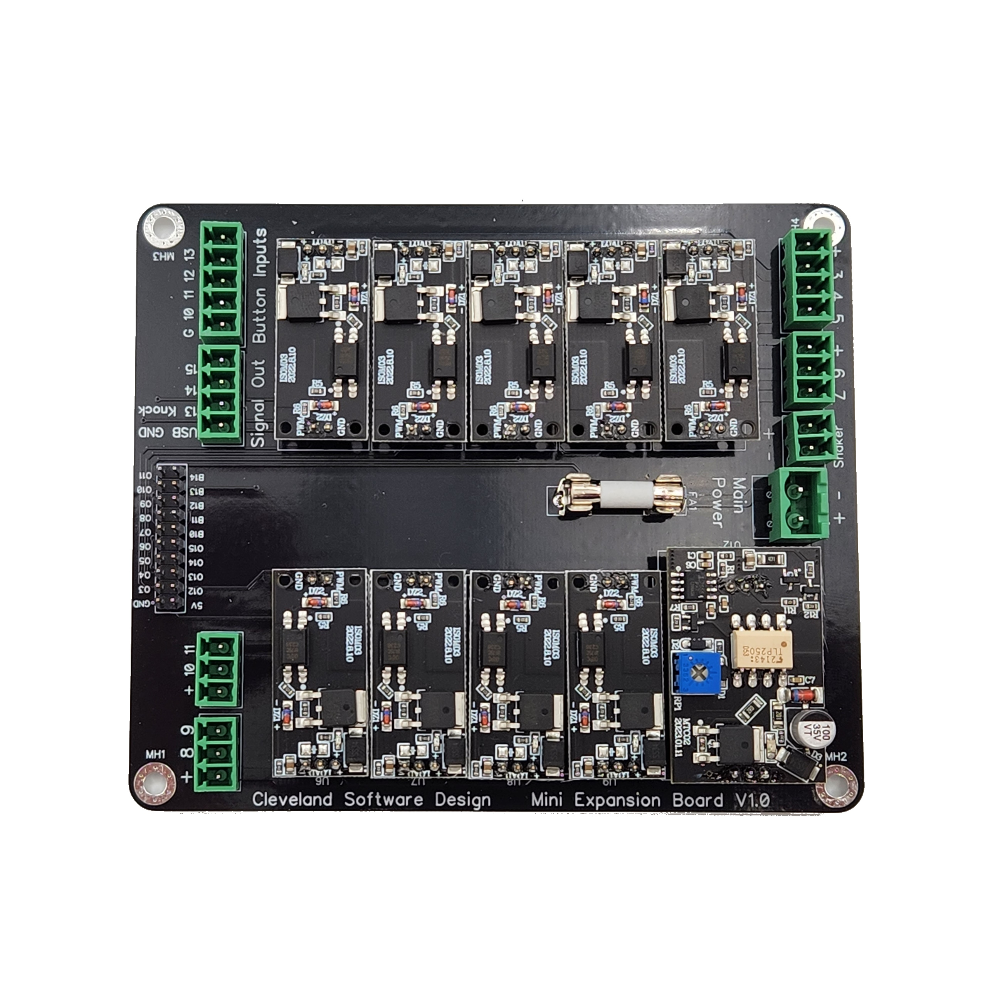
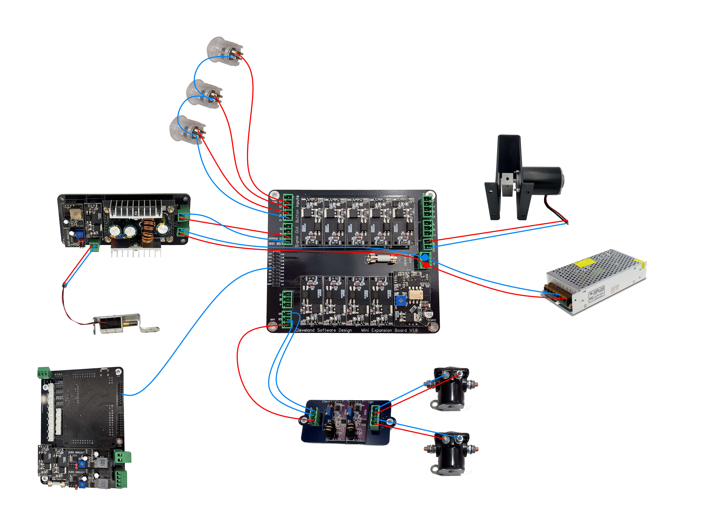

# PinOne Mini Expansion board

## Introduction

The PinOne Mini Expansion board adds inputs and outputs so that it essentially has the same capabilities as a PinOne Main board with the Button Board attached to it. It adds the following to your setup:

- 10 high power outputs (9 Mosfet and 1 motor speed controller)
- 3 low power signal outputs (20mA)
- 4 additional button inputs via screw terminals

## Hooking it all up

Below is the approach to connect various devices to the PinOne Mini expansion board:

