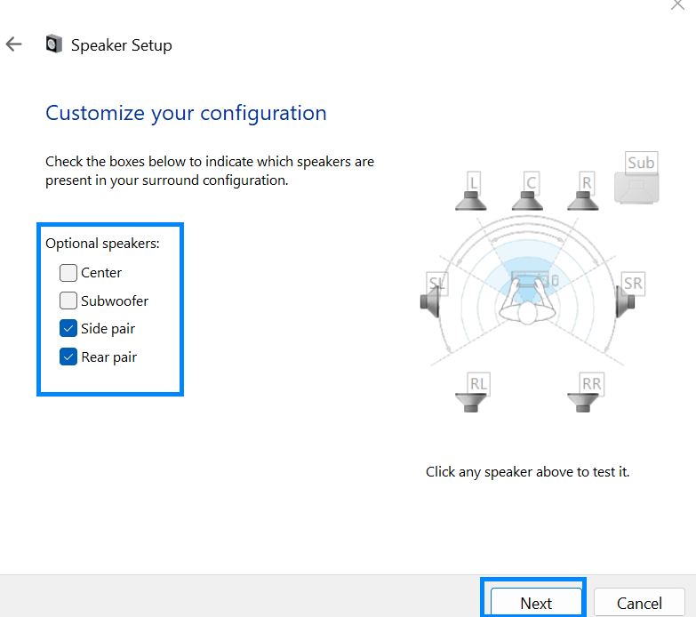

# Configuring the sound card

Before you can use the extra speakers in your cabinet, you need to configure SSF for your cabinet. After plugging in the soundcard into your computer, DO NOT INSTALL ANY SOFTWARE. Lots of sound cards come with their own proprietary software that allows you to configure the speakers, audio levels and enable other features, but in all reality, this software is mostly bloatware and does nothing needed for SSF.

Follow the below steps to configure the soundcard on your computer the **right way**

1. Go to control panel and click on "Sound"

2. Next in the properties window, select the USB sound device and click "Configure"

3. Select 5.1 or 7.1 surround sound, depending on if you have a 5.1 or 7.1 sound card. The 2.1 SSF kit will come with a 5.1 channel surround sound system, and the 4.2 SSF kit will come with a 7.1 channel surround sound system.

4. In the next step, turn off the subwoofer, as you will not be using the subwoofer output on the sound card for the SSF speakers.

5. In the last step, ensure all the speakers are set to full range, click next and finish the setup and you are ready to go!

