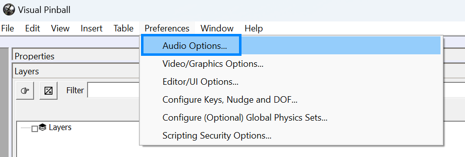
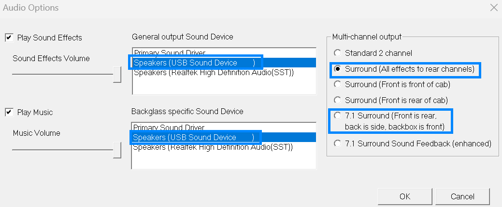

# Configuring SSF on Visual Pinball

It doesn't get much easier than this! Once you have the sound card configured, simply open the audio preferences menu in VPX

and set the configuration for your SSF setup. If you have a 5.1 channel sound card (2.1 SSF Kit), then select the "All effects to rear channels" option, and if you have a 7.1 channel sound card (4.2 SSF Kit), then select the 7.1 channel option as highlighted below:

That's it for VPX, you should now hear all your effects from the SSF system the next time you start your game.