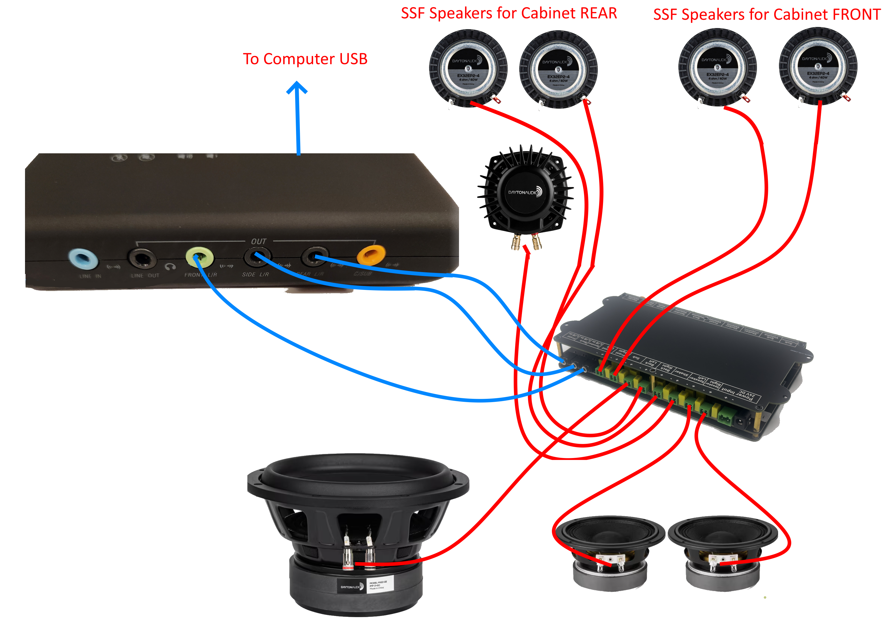

import Video from '@site/src/components/Video';

# Installing the SSF Kit

The best way to know how to install the kit into your machine, is to simply follow this video below, but I also have a simple diagram showing how everything connects below:

### Use the link below to go right to the SSF install timestamp
[Video link](https://youtu.be/9LoyJR7UnCA?t=2822)

<Video source="https://www.youtube.com/embed/9LoyJR7UnCA?t=2822"></Video>
